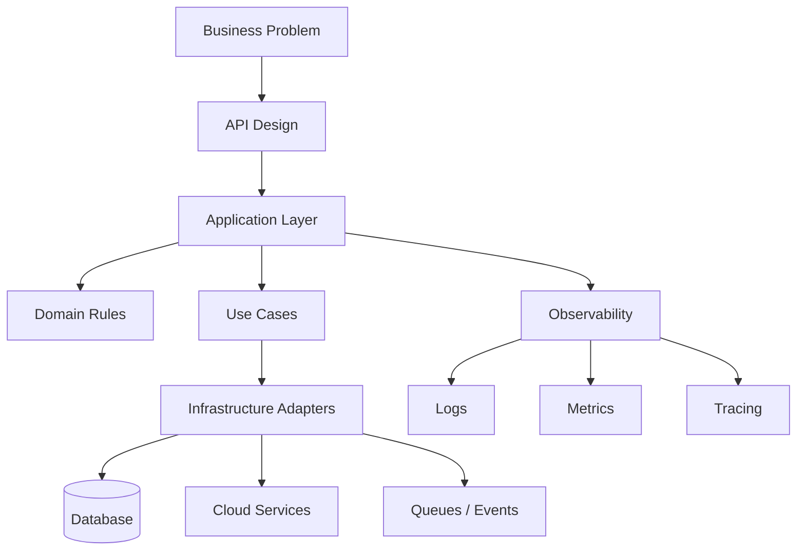
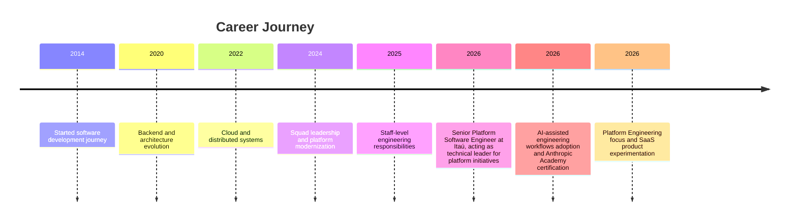

<p align="center">
  
</p>

<div align="center">

# Gabriel Vieira

### Senior Platform Software Engineer
### Platform Engineering • Cloud • Distributed Systems • Developer Experience

Building internal platforms, resilient distributed systems and developer-focused solutions with clean architecture and pragmatic engineering.

<p>
  
  
  
  
  
</p>

</div>

---

<div align="center">


</div>

---

# About Me

I'm a Brazilian software engineer focused on platform engineering, distributed systems, cloud-native architecture and developer experience.

Over the years I have worked across fintech, proptech, energy, SaaS, automation, APIs and internal developer platforms.

I strongly value clean architecture, technical ownership, mentoring, documentation, developer productivity and pragmatic decisions over hype.

---

# Recent Impact

## Internal Platform Evolution

- Contributed to the evolution of internal platform components and services
- Participated in internal platform architecture discussions and reviews
- Contributed to deployment workflows and platform governance
- Improved developer experience through documentation and technical guidance

## Engineering Enablement

- Supported onboarding of engineers
- Created technical documentation and reference materials
- Shared platform knowledge across teams
- Participated in architecture and implementation reviews

## Reliability & Operations

- Supported production change processes
- Contributed to infrastructure modernization efforts
- Participated in observability and operational readiness initiatives

---

# Snapshot

<table>
<tr>
<td width="50%">

## Current Role

### Senior Platform Software Engineer at Itaú

Acting as technical leader for platform initiatives, engineering standards and developer enablement in one of the largest financial institutions in Latin America.

</td>
<td width="50%">

## Main Focus

- Platform Engineering
- Distributed Systems
- Cloud Architecture
- Developer Experience
- Observability
- Scalable APIs

</td>
</tr>

<tr>
<td width="50%">

## Main Stack

- Go
- AWS
- Python
- Docker
- Kubernetes
- IaC

</td>
<td width="50%">

## Career Direction — Staff Platform Engineer

- Platform Architecture
- Organizational Influence
- Engineering Leadership
- SaaS Products
- Open Source & Community

</td>
</tr>
</table>

---

# Platform Engineering

Areas where I actively contribute:

- Internal Developer Platforms
- Golden Paths
- Cloud Governance
- Engineering Enablement
- Developer Experience
- Infrastructure Automation
- Platform Reliability
- Observability
- Service Lifecycle Management
- Internal Tooling

---

# Enterprise Initiatives

## Internal Developer Platform Evolution

Contributing to platform architecture, developer enablement and engineering workflows.

## Cloud Platform Governance

Supporting infrastructure standards, deployment processes and cloud operational practices.

## Developer Experience

Working on documentation, onboarding, Golden Paths and engineering enablement initiatives.

---

# Professional Experience

## Itaú

Working with scalable systems, platform engineering, cloud integrations and backend architecture.

### Senior Platform Software Engineer *(current)*

Acting as technical leader for platform initiatives, engineering standards and developer enablement.

**Responsibilities**

- backend and platform architecture evolution
- distributed systems and scalable APIs
- platform reliability and observability
- developer experience and internal engineering tooling
- cloud integrations
- technical alignment across engineering, product and stakeholders
- mentoring engineers and supporting technical growth within the team
- owning engineering standards and delivery quality for the squad

**Impact**

- improved developer productivity across teams through tooling and documentation
- contributed to platform evolution and engineering culture
- helped teams adopt better engineering practices and improve operational visibility
- supported clients and internal users in becoming more productive on the platform

---

## Superlógica Imobi — Senior Software Engineer

Worked on large-scale real estate systems and modernization initiatives.

### Highlights

- API integrations
- automation
- scalable backend services
- architectural evolution
- internal tooling
- developer productivity improvements

---

## Órigo Energia — Software Engineer

Worked on backend solutions and automation for the energy sector.

### Focus

- integrations
- cloud services
- backend systems
- performance
- operational workflows

---

# Architecture Mindset



---

# Architecture SVG

<p align="center">
  
</p>

---

# Professional Timeline



---

# Technical Expertise

## Backend

<p>


</p>

### Main Technologies

- Go (Gin, net/http, Gorilla WebSocket, Uber FX)
- PHP (Laravel, pure PHP)
- Rust (Axum, Tokio, SQLx)
- Node.js / TypeScript
- Python (FastAPI, Flask)
- .NET APIs

---

## Cloud & Infrastructure

<p>


</p>

### Main Areas

- AWS
- Kubernetes
- Docker
- Vagrant
- Terraform
- CI/CD
- Observability
- Distributed Systems

---

## AI Engineering

### Tools

- Claude Code
- ChatGPT
- GitHub Copilot

### Areas

- Prompt Engineering
- AI-assisted Architecture & Documentation
- AI-assisted Product Discovery
- Engineering Productivity & Knowledge Systems

### Philosophy

AI as a force multiplier for engineering teams, not a replacement for technical expertise — focused on better decisions, less repetitive work and faster learning velocity.

---

# Notable Projects

Selected personal projects, used as labs to experiment with architecture, product thinking and AI-assisted workflows.

## CityScope API

Urban indicators API powered by Brazilian public data.

### Stack

- Go
- REST APIs
- OpenAPI
- Caching
- Structured Logging

### Highlights

- Brazilian city indicators
- population data
- density analysis
- public data aggregation

---

## Construction Weather Intelligence

Construction SaaS powered by weather intelligence.

### Stack

- Rust
- Rules Engine
- OpenAPI
- AI-assisted recommendations

### Highlights

- weather analysis
- service recommendations
- operational planning
- construction risk evaluation

---

## MarketWatch

Competitive price monitoring and crawling platform.

### Stack

- Rust
- PostgreSQL
- JWT
- SQLx
- Axum

### Highlights

- crawling orchestration
- price snapshots
- scalable backend design
- monitoring pipelines

---

## Magic Collector

Magic: The Gathering collection manager focused on local inventory and external API integrations.

### Stack

- Go
- React
- SQLite
- REST APIs
- MTG APIs

### Highlights

- collection analysis
- rarity normalization
- local inventory management
- deck organization
- external API integrations

---

## FolcloreBeat

2D beat 'em up inspired by Brazilian folklore.

### Stack

- Go
- Ebiten2

### Highlights

- original combat system
- folklore-inspired enemies
- retro arcade inspiration

---

# Engineering Philosophy

> Good engineering is not about using the most complex solution. It is about creating systems people can understand, evolve and trust.

- Build simple systems first, and prefer maintainability over complexity
- Optimize for developer productivity
- Measure before optimizing, and observe before scaling
- Automate repetitive work
- Document decisions as part of delivery
- Design for evolution with business purpose in mind

---

# Leadership & Mentoring

- Acting as technical leader for platform engineering initiatives at Itaú
- Led 3 engineering squads across different business domains
- Mentored developers and participated in architectural decisions
- Helped establish engineering standards, architectural guidelines and development practices
- Strong collaboration with QA, Product and DevOps
- Documentation-driven, knowledge-sharing engineering mindset

---

# Education

### PUC Minas - MBA — Cloud Computing *(in progress)*

### PUC Minas - MBA — Distributed Software Architecture

### Uninove - Computer Science - (2015 - 2019)

### Uninove - Web Development - (2016 - 2018)

---

# Courses & Certifications — 2026

Ongoing log of courses and learning trails completed throughout the year.

## Anthropic Academy

- Claude 101
- Claude Code 101
- Claude Platform 101
- Claude Code in Action
- AI Fluency: Framework & Foundations

## DIO — Formação Docker Fundamentals

- 12-course track covering Docker and Vagrant

## DIO — Formação Kubernetes Fundamentals

- 14-course track covering DevOps, K8s, CI/CD and SRE topics

---

# Beyond Engineering

Interests that expand my engineering perspective and feed back into how I build systems:

- AI-assisted software engineering and prompt engineering
- SaaS product design and public data platforms
- Game architecture — combat systems and fighting game mechanics
- Developer Experience (DX) and platform engineering research
- Technical content creation
- Magic: The Gathering and Brazilian folklore storytelling

---

# Tech Radar

| Area | Technologies |
|---|---|
| Backend | Go, Rust, PHP, Python, TypeScript |
| Frontend | React, Vite |
| Infra | Docker, Vagrant, Kubernetes, Terraform |
| Cloud | AWS |
| Database | PostgreSQL, MySQL, DynamoDB, MongoDB |
| Messaging | RabbitMQ, Redis, SQS |
| Observability | Grafana, Datadog, CloudWatch |
| Architecture | Clean Architecture, DDD, Hexagonal |

---

# PDI — Professional Development Plan 2026

```yaml
PDI_2026:

  completed:
    - Anthropic Academy learning path (Claude 101, Claude Code 101, Claude Platform 101, Claude Code in Action, AI Fluency: Framework & Foundations)
    - AI-assisted engineering workflows adoption
    - mastery of AI-assisted software development workflows and prompt engineering
    - reference in AI for engineering productivity
    - integration of AI into platform engineering practices
    - strengthened platform engineering expertise and developer experience initiatives
    - evolved technical leadership capabilities and mentoring skills
    - improved onboarding and product thinking for platform users
    - strengthened collaboration and knowledge sharing across teams

  in_progress:
    - MBA in Cloud Computing at PUC Minas
    - AWS certification renewal
    - Staff Platform Engineer skill development
    - contributing to internal developer platforms
    - evolving engineering enablement capabilities
    - building production-ready AI-powered products
    - studying multi-agent systems and LLM architecture

  next_focus:
    - organizational influence and platform adoption strategies
    - engineering metrics and platform observability at scale
    - internal platform product management
    - AI-powered platform capabilities in production
    - launching and validating personal SaaS products
```

---

<div align="center">

## Let's Connect

Engineering • Platform • Distributed Systems • Cloud

</div>

<p align="center">
  
</p>
