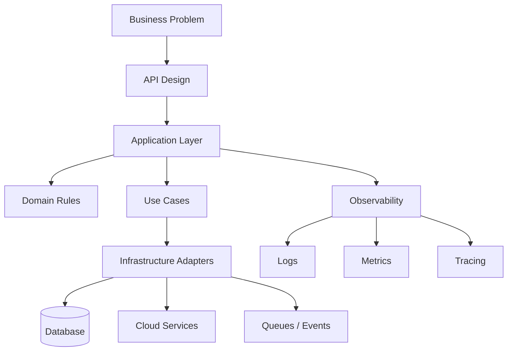
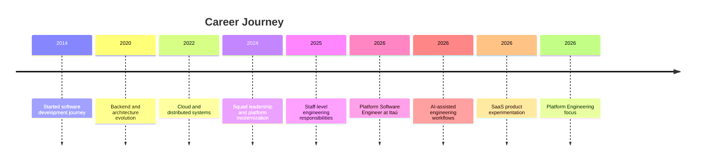

<p align="center">
  
</p>

<div align="center">

# Gabriel Vieira

### Platform Software Engineer
### Backend • Cloud • Distributed Systems • AI Engineering • Developer Experience

Building scalable platforms, resilient distributed systems and developer-focused solutions with clean architecture and pragmatic engineering.

<p>
  
  
  
  
  
</p>

</div>

---

<div align="center">


</div>

---

# About Me

I'm a Brazilian software engineer focused on backend engineering, distributed systems, cloud-native architecture and developer experience.

Over the years I have worked across:

- fintech
- proptech
- energy
- SaaS
- automation
- APIs
- cloud platforms
- internal developer platforms

My main focus is building systems that are:

- scalable
- maintainable
- observable
- resilient
- simple to evolve
- useful for both business and engineering teams

I strongly value:

- clean architecture
- engineering culture
- technical ownership
- mentoring
- documentation
- pragmatic decisions over hype
- developer productivity
- long-term maintainability

---

# Engineering Beyond Code

Beyond enterprise software development, I enjoy exploring adjacent areas that expand my engineering perspective and help me build better systems.

My interests go beyond traditional backend development and include:

- AI-assisted software engineering
- SaaS product design
- Game architecture and combat systems
- Developer Experience (DX)
- Platform Engineering
- Public data platforms
- Automation systems
- Technical content creation
- Cloud-native experimentation

I believe the best engineers learn across multiple domains and bring those insights back into software engineering.

Many of my personal projects are laboratories where I experiment with architecture, product design, AI-assisted workflows and emerging technologies.

---

# Dashboard

<table>
<tr>
<td width="50%">

## Current Role

### Platform Software Engineer at Itaú

Working with scalable systems, platform reliability, cloud integrations and developer experience in one of the largest financial institutions in Latin America.

</td>
<td width="50%">

## Main Focus

- Platform Engineering
- Distributed Systems
- Cloud Architecture
- Developer Experience
- Observability
- Scalable APIs

</td>
</tr>

<tr>
<td width="50%">

## Main Stack

- Go
- AWS
- Python
- Docker
- Kubernetes
- IaC
- Infraestructure

</td>
<td width="50%">

## Career Direction

- Staff Engineering
- Platform Architecture
- Engineering Leadership
- Open Source
- SaaS Products
- Community Building

</td>
</tr>
</table>

---

## Innovation Focus

- AI Engineering
- Platform Engineering
- Developer Productivity
- SaaS Products
- Technical Experimentation
- Architecture Reviews

# Currently Building

```yaml
currently_building:

  - CityScope API:
      description: "Urban indicators API powered by Brazilian public data"
      stack:
        - Go
        - IBGE APIs
        - OpenAPI

  - Construction Weather Intelligence:
      description: "Construction planning SaaS powered by weather intelligence and AI-assisted recommendations"
      stack:
        - Rust
        - Rules Engine
        - AI Integration
        - OpenAPI

  - MarketWatch:
      description: "Competitive monitoring and market intelligence platform"
      stack:
        - Rust
        - PostgreSQL
        - JWT
        - Axum

  - Magic Collector:
      description: "Magic: The Gathering collection and deck management platform"
      stack:
        - Go
        - React
        - SQLite
        - Scryfall API

  - FolcloreBeat:
      description: "2D beat 'em up inspired by Brazilian folklore"
      stack:
        - Go
        - Ebiten2

  - AI Engineering Workflows:
      description: "Engineering workflows powered by Claude, ChatGPT and AI-assisted development"
      stack:
        - Claude Code
        - ChatGPT
        - Prompt Engineering
        - Architecture Reviews

  - Fighting Game Architecture Research:
      description: "Professional fighting game systems and combat architecture studies"
      stack:
        - Godot
        - State Machines
        - Gameplay Systems
```
---

# Engineering Snapshot

| Category | Highlights |
|-----------|-----------|
| Experience | 10+ years |
| Current Role | Platform Software Engineer |
| Main Languages | Go, PHP, Rust, Python |
| Cloud | AWS |
| Architecture | DDD, Clean Architecture, Hexagonal |
| Leadership | 3 Squads Led |
| Focus Areas | Platform Engineering, AI Engineering, DX |
| Current Goal | Staff Engineer |

---

# Architecture Mindset



---

# Architecture SVG

<p align="center">
  
</p>

---

# Professional Timeline



---

# Professional Experience

## Itaú — Platform Software Engineer

Working with scalable systems, platform engineering, cloud integrations and backend architecture in one of the largest financial institutions in Latin America.

### Main Responsibilities

- backend architecture evolution
- distributed systems
- platform reliability
- developer experience
- observability
- cloud integrations
- internal engineering tooling
- scalable APIs
- technical discussions and alignment
- engineering collaboration

### Important

- helping improve developer productivity across teams
- supporting scalable engineering initiatives
- contributing to platform evolution
- helping teams adopt better engineering practices
- improving operational visibility and observability
- contributing to engineering culture
- creating maintainable and scalable technical solutions
- helping clients and internal users become more productive using the platform
- strengthening community and collaboration between engineering teams
- sharing knowledge and technical context with developers
- aiming to become a strong technical reference within the engineering community

### Easy To Expand

```yaml
future_focus:
  - developer enablement
  - internal platform evolution
  - engineering standards
  - technical mentorship
  - scalability initiatives
  - engineering productivity
  - community engagement
```

---

## Superlógica Imobi — Senior Software Engineer

Worked on large-scale real estate systems and modernization initiatives.

### Highlights

- API integrations
- automation
- scalable backend services
- architectural evolution
- internal tooling
- developer productivity improvements

---

## Órigo Energia — Software Engineer

Worked on backend solutions and automation for the energy sector.

### Focus

- integrations
- cloud services
- backend systems
- performance
- operational workflows

---

# Technical Expertise

## Backend

<p>


</p>

### Main Technologies

- Go (Gin, net/http, Gorilla WebSocket, Uber FX)
- PHP (Laravel, pure PHP)
- Rust (Axum, Tokio, SQLx)
- Node.js / TypeScript
- Python (FastAPI, Flask)
- .NET APIs

---

## Cloud & Infrastructure

<p>


</p>

### Main Areas

- AWS
- Kubernetes
- Docker
- Terraform
- CI/CD
- Observability
- Distributed Systems

---

# Notable Projects

## CityScope API

Urban indicators API powered by Brazilian public data.

### Stack

- Go
- REST APIs
- OpenAPI
- Caching
- Structured Logging

### Highlights

- Brazilian city indicators
- population data
- density analysis
- public data aggregation

---

## Construction Weather Intelligence

Construction SaaS powered by weather intelligence.

### Stack

- Rust
- Rules Engine
- OpenAPI
- AI-assisted recommendations

### Highlights

- weather analysis
- service recommendations
- operational planning
- construction risk evaluation

---

## MarketWatch

Competitive price monitoring and crawling platform.

### Stack

- Rust
- PostgreSQL
- JWT
- SQLx
- Axum

### Highlights

- crawling orchestration
- price snapshots
- scalable backend design
- monitoring pipelines

---

## Magic Collector

Magic: The Gathering collection manager focused on local inventory and external API integrations.

### Stack

- Go
- React
- SQLite
- REST APIs
- MTG APIs

### Highlights

- collection analysis
- rarity normalization
- local inventory management
- deck organization
- external API integrations

---

## FolcloreBeat

2D beat 'em up inspired by Brazilian folklore.

### Stack

- Go
- Ebiten2

### Highlights

- original combat system
- folklore-inspired enemies
- retro arcade inspiration

## AI Engineering

### Tools

- Claude Code
- ChatGPT
- GitHub Copilot
- LLM-assisted development workflows

### Areas

- Prompt Engineering
- AI-assisted Architecture
- Documentation Generation
- Product Discovery
- Engineering Productivity
- Knowledge Systems

---

# AI & Innovation

I actively explore practical applications of AI to improve engineering productivity, architecture decisions and developer experience.

## Areas of Experimentation

- Claude Code workflows
- ChatGPT-assisted engineering
- AI-assisted architecture reviews
- Prompt engineering
- AI-generated technical documentation
- AI-enhanced product discovery
- AI-assisted SaaS development
- Knowledge augmentation systems

## Engineering Philosophy

My goal is not replacing engineers with AI.

My focus is helping engineers:

- make better decisions
- reduce repetitive work
- improve software quality
- accelerate delivery
- increase productivity
- improve learning velocity

I see AI as a force multiplier for engineering teams rather than a replacement for technical expertise.

---

# Leadership & Mentoring

- Led engineering squads
- Mentored developers
- Participated in architectural decisions
- Helped define engineering standards
- Strong collaboration with QA, Product and DevOps
- Documentation-driven engineering mindset
- Knowledge sharing initiatives
- Cross-team collaboration

---

# Education

## PUC Minas

### MBA — Cloud Computing *(in progress)*

### Postgraduate Degree — Distributed Software Architecture

---

# Engineering Philosophy

> Good engineering is not about using the most complex solution.  
> It is about creating systems people can understand, evolve and trust.

I prefer:

- simple systems over magical abstractions
- consistency over unnecessary innovation
- observability before optimization
- architecture with business purpose
- long-term maintainability
- documentation as part of delivery

---

# Areas I Enjoy Working With

- platform engineering
- internal developer platforms
- backend APIs
- distributed systems
- event-driven architectures
- automation
- observability
- scalable SaaS products
- game backend architecture
- engineering culture

---

# Community & Long-Term Goals

```yaml
goals:
  - become a strong technical reference in the engineering community
  - contribute to developer growth and mentoring
  - help teams become more productive through better platforms
  - improve developer experience and engineering culture
  - contribute to scalable engineering ecosystems
  - create meaningful SaaS products
  - share technical knowledge publicly
  - strengthen collaboration between teams and communities
```
---

# Technical Interests

Current areas that I actively study and explore:

- Platform Engineering
- Distributed Systems
- AI Engineering
- Developer Experience
- Cloud Native Architecture
- SaaS Products
- Public Data Platforms
- Game Development
- Fighting Game Architecture
- Observability
- Product Engineering
- Automation Systems
- Knowledge Management

---

# Tech Radar

| Area | Technologies |
|---|---|
| Backend | Go, Rust, PHP, Python, TypeScript |
| Frontend | React, Vite |
| Infra | Docker, Kubernetes, Terraform |
| Cloud | AWS |
| Database | PostgreSQL, MySQL, DynamoDB, MongoDB |
| Messaging | RabbitMQ, Redis, SQS |
| Observability | Grafana, Datadog, CloudWatch |
| Architecture | Clean Architecture, DDD, Hexagonal |

---

# Fun Facts

Besides backend engineering, I also enjoy:

- building SaaS products
- creating game prototypes
- studying fighting game architecture
- AI-assisted development
- prompt engineering
- Magic: The Gathering
- Brazilian folklore storytelling
- automation systems
- public data platforms
- architecture experimentation

---

# PDI — Professional Development Plan

```yaml
2026_:

  certifications:
    - renew AWS Cloud Practitioner certification
    - study for AWS Developer / Cloud Developer certification
    - deepen cloud-native architecture expertise
    - pursue AI-related certifications and learning paths

  education:
    - complete MBA in Cloud Computing at PUC Minas this year
    - continue improving distributed systems and platform engineering knowledge

  artificial_intelligence:
    - study practical AI applications for engineering
    - complete Anthropic learning trails
    - explore AI-assisted developer tooling and workflows
    - understand how AI can improve engineering productivity and platform experience

  leadership:
    - evolve technical leadership capabilities
    - strengthen Staff Engineer responsibilities
    - explore Tech Lead responsibilities and organizational impact
    - improve communication and mentoring skills

  product_and_business:
    - improve onboarding experience for product clients
    - help customers become more productive using the platform
    - evolve product thinking and SaaS scalability vision
    - strengthen relationship between engineering and users

  community:
    - become more active in the engineering community
    - participate more actively in FRA initiatives and discussions
    - share more technical content and engineering experiences
    - strengthen collaboration and knowledge sharing

  continuous_learning:
    - consume more external technical content
    - study architecture case studies from large companies
    - follow modern platform engineering references
    - deepen observability and distributed systems knowledge
      - maintain continuous long-term technical evolution

  ai_engineering:  
    - master AI-assisted software development workflows
    - deepen prompt engineering expertise
    - become a reference in AI for engineering productivity
    - integrate AI into platform engineering practices
    - build production-ready AI-powered products
    - study multi-agent systems
    - deepen LLM architecture knowledge
  
  platform_engineering:
    - strengthen platform engineering expertise
    - improve developer experience initiatives
    - contribute to internal developer platforms
    - evolve engineering enablement capabilities
  
  product_building:
    - launch personal SaaS products
    - validate product ideas
    - improve product thinking
    - strengthen business and engineering alignment
```

### Easy To Expand

```yaml
future_topics:
  - public speaking
  - open source contributions
  - engineering articles
  - technical workshops
  - AI engineering
  - developer experience
  - architecture reviews
  - platform strategy
```

# Personal Projects Philosophy

Most of my personal projects are intentionally built as learning platforms.

Each project is an opportunity to explore:

- new technologies
- architectural patterns
- developer experience improvements
- AI-assisted workflows
- cloud-native solutions
- product thinking

Rather than building projects only for portfolios, I use them as environments to experiment, validate ideas and continuously evolve as an engineer.


<div align="center">

## Let's Connect

Engineering • Architecture • Distributed Systems • Cloud • Platforms

</div>

<p align="center">
  
</p>
