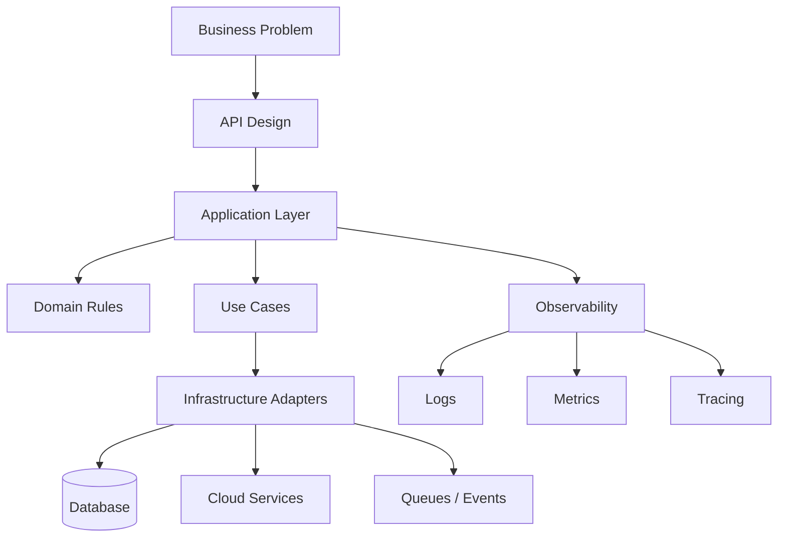
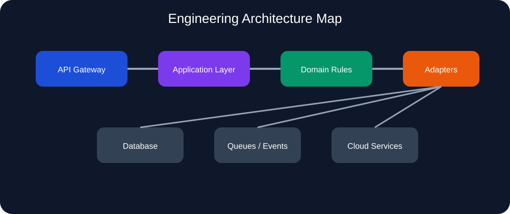
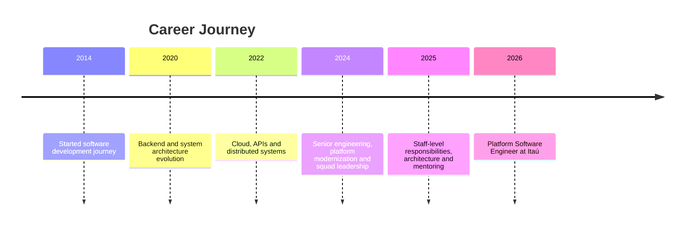

<p align="center">
  
</p>

<div align="center">

### Staff / Platform Software Engineer  
#### Backend • Distributed Systems • Cloud • Clean Architecture • Developer Experience

Building scalable platforms, APIs and cloud-native systems with pragmatic engineering, observability and long-term maintainability.

</div>

---

<div align="center">


</div>

---

# About Me

I'm a Brazilian software engineer focused on backend engineering, platform engineering, distributed systems and cloud-native architecture.

I have worked across fintech, proptech, energy, SaaS, automation, APIs, cloud platforms and internal developer tools.

My main focus is building systems that are:

- scalable
- observable
- maintainable
- resilient
- simple to evolve
- useful for both business and engineering teams

I strongly value clean architecture, engineering culture, mentoring, documentation, technical ownership and pragmatic decisions.

---

# Dashboard

<table>
<tr>
<td width="50%">

## Current Role

**Platform Software Engineer at Itaú**

Working with scalable systems, platform reliability, backend architecture, developer experience and cloud integration.

</td>
<td width="50%">

## Engineering Focus

- Platform Engineering
- Backend Architecture
- Distributed Systems
- Cloud Solutions
- Developer Experience
- Observability

</td>
</tr>

<tr>
<td width="50%">

## Main Stack

- Go
- PHP
- Rust
- TypeScript
- Python
- AWS
- Docker
- Kubernetes

</td>
<td width="50%">

## Career Direction

- Staff Engineering
- Platform Architecture
- Distributed Systems
- Engineering Leadership
- Open Source
- SaaS Products

</td>
</tr>
</table>

---

# Currently Building

```yaml
currently_building:
  - CityScope API:
      description: "Urban indicators API powered by Brazilian public data"
      stack: ["Go", "IBGE APIs", "OpenAPI", "Caching"]

  - Construction Weather Intelligence:
      description: "SaaS that evaluates construction services based on weather forecasts"
      stack: ["Rust", "Rules Engine", "AI-assisted recommendations"]

  - MarketWatch:
      description: "Competitive price monitoring and crawling platform"
      stack: ["Rust", "PostgreSQL", "JWT", "Axum"]

  - FolcloreBeat:
      description: "2D beat 'em up game inspired by Brazilian folklore"
      stack: ["Go", "Ebiten2"]
```

---

# GitHub Stats

> Replace `VieiraGabrielAlexandre` with your GitHub username.

<div align="center">


</div>

<div align="center">


</div>

---

# Architecture Mindset

<div align="center">



</div>

---

# Architecture SVG

Save this as `assets/architecture.svg` and reference it in your README.

<svg width="1000" height="420" viewBox="0 0 1000 420" xmlns="http://www.w3.org/2000/svg">
  <rect width="1000" height="420" rx="24" fill="#0f172a"/>
  <text x="500" y="45" text-anchor="middle" fill="#ffffff" font-size="26" font-family="Arial">Engineering Architecture Map</text>

  <rect x="70" y="100" width="180" height="70" rx="14" fill="#1d4ed8"/>
  <text x="160" y="142" text-anchor="middle" fill="#ffffff" font-size="16" font-family="Arial">API Gateway</text>

  <rect x="310" y="100" width="180" height="70" rx="14" fill="#7c3aed"/>
  <text x="400" y="142" text-anchor="middle" fill="#ffffff" font-size="16" font-family="Arial">Application Layer</text>

  <rect x="550" y="100" width="180" height="70" rx="14" fill="#059669"/>
  <text x="640" y="142" text-anchor="middle" fill="#ffffff" font-size="16" font-family="Arial">Domain Rules</text>

  <rect x="790" y="100" width="150" height="70" rx="14" fill="#ea580c"/>
  <text x="865" y="142" text-anchor="middle" fill="#ffffff" font-size="16" font-family="Arial">Adapters</text>

  <rect x="190" y="250" width="170" height="70" rx="14" fill="#334155"/>
  <text x="275" y="292" text-anchor="middle" fill="#ffffff" font-size="16" font-family="Arial">Database</text>

  <rect x="420" y="250" width="170" height="70" rx="14" fill="#334155"/>
  <text x="505" y="292" text-anchor="middle" fill="#ffffff" font-size="16" font-family="Arial">Queues / Events</text>

  <rect x="650" y="250" width="170" height="70" rx="14" fill="#334155"/>
  <text x="735" y="292" text-anchor="middle" fill="#ffffff" font-size="16" font-family="Arial">Cloud Services</text>

  <line x1="250" y1="135" x2="310" y2="135" stroke="#94a3b8" stroke-width="4"/>
  <line x1="490" y1="135" x2="550" y2="135" stroke="#94a3b8" stroke-width="4"/>
  <line x1="730" y1="135" x2="790" y2="135" stroke="#94a3b8" stroke-width="4"/>

  <line x1="865" y1="170" x2="275" y2="250" stroke="#94a3b8" stroke-width="3"/>
  <line x1="865" y1="170" x2="505" y2="250" stroke="#94a3b8" stroke-width="3"/>
  <line x1="865" y1="170" x2="735" y2="250" stroke="#94a3b8" stroke-width="3"/>
</svg>

Then use:

<p align="center">
  
</p>

---

# Professional Timeline



---

# Professional Highlights

## Itaú — Platform Software Engineer

Working with platform engineering and scalable systems in one of the largest financial institutions in Latin America.

Main areas:

- distributed systems
- backend architecture
- developer experience
- platform reliability
- cloud integration
- observability

---

## Superlógica Imobi — Senior Software Engineer

Worked on large-scale real estate systems and platform modernization initiatives.

Highlights:

- API integrations
- automation
- scalable backend services
- developer productivity improvements
- architectural evolution
- internal tooling

---

## Órigo Energia — Software Engineer

Worked on backend solutions and business process automation for the energy sector.

Focus:

- integrations
- cloud services
- performance
- backend systems
- operational workflows

---

# Technical Expertise

## Backend

<p>


</p>

- Go: Gin, net/http, Gorilla WebSocket, Uber FX
- PHP: Laravel, pure PHP
- Rust: Axum, Tokio, SQLx
- Node.js / TypeScript
- Python: FastAPI, Flask
- .NET APIs

---

## Cloud & Infrastructure

<p>


</p>

- Lambda
- API Gateway
- S3
- DynamoDB
- SQS
- SNS
- CloudFront
- Cognito
- WAF
- IAM
- Docker
- Kubernetes
- Terraform
- CI/CD

---

## Architecture

- Clean Architecture
- Hexagonal Architecture
- DDD
- Event Driven Systems
- Microservices
- Distributed Systems
- API-first design
- Observability-first systems

---

# Notable Projects

<table>
<tr>
<td width="50%">

## CityScope API

Urban indicators API powered by IBGE public data.

**Stack:** Go, REST, OpenAPI, cache, logs

**Highlights:**

- Brazilian city indicators
- population data
- density analysis
- public data aggregation

</td>
<td width="50%">

## Construction Weather Intelligence

SaaS that evaluates construction services based on weather.

**Stack:** Rust, rules engine, OpenAPI, AI-assisted output

**Highlights:**

- weather risk analysis
- service recommendations
- construction planning

</td>
</tr>

<tr>
<td width="50%">

## MarketWatch

Competitive price monitoring and crawling platform.

**Stack:** Rust, PostgreSQL, JWT, Axum

**Highlights:**

- crawling orchestration
- price snapshots
- scalable backend design

</td>
<td width="50%">

## FolcloreBeat

2D beat 'em up game inspired by Brazilian folklore.

**Stack:** Go, Ebiten2

**Highlights:**

- original combat system
- Brazilian folklore creatures
- retro arcade inspiration

</td>
</tr>
</table>

---

# Leadership & Mentoring

- Led 3 engineering squads
- Mentored developers
- Participated in architectural decisions
- Helped define engineering standards
- Worked closely with QA, Product and DevOps
- Promoted documentation-driven engineering
- Supported technical alignment across teams

---

# Education

## PUC Minas

**MBA — Cloud Computing**  
In progress

**Postgraduate Degree — Distributed Software Architecture**  
Completed

---

# Engineering Philosophy

> Good engineering is not about using the most complex solution.  
> It is about creating systems people can understand, evolve and trust.

I prefer:

- simple systems over magical abstractions
- consistency over unnecessary innovation
- observability before optimization
- architecture with business purpose
- long-term maintainability
- documentation as part of delivery

---

# Areas I Enjoy Working With

- platform engineering
- internal developer platforms
- backend APIs
- event-driven architectures
- distributed systems
- automation
- developer tooling
- observability
- scalable SaaS products
- game backend architecture

---

# Tech Radar

| Area | Technologies |
|---|---|
| Backend | Go, Rust, PHP, Python, TypeScript |
| Frontend | React, Vite |
| Infra | Docker, Kubernetes, Terraform |
| Cloud | AWS |
| Database | PostgreSQL, MySQL, DynamoDB, MongoDB |
| Messaging | RabbitMQ, Redis, SQS |
| Observability | Grafana, Datadog, CloudWatch |
| Architecture | Clean Architecture, DDD, Hexagonal |

---

# Fun Facts

Besides backend engineering, I also enjoy:

- creating game prototypes
- studying fighting game architecture
- AI-generated media projects
- Magic: The Gathering
- Brazilian folklore storytelling
- building experimental tools

---

<div align="center">

## Let's Connect

Engineering • Architecture • Distributed Systems • Cloud • Platforms

</div>

<p align="center">
  
</p>
